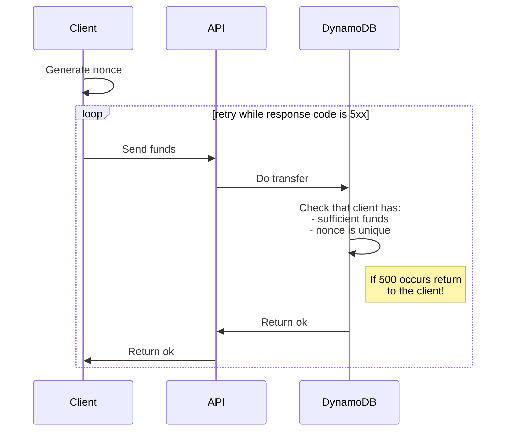
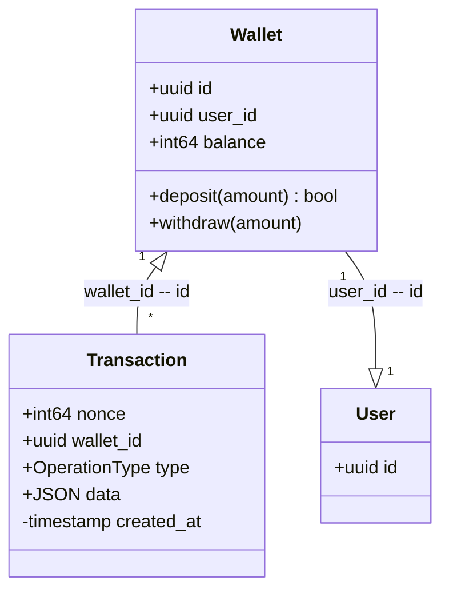

# Glossary
**Idempotent** - the operation has the same intended effect on the server state, independently of whether it is executed once or multiple times.

**DynamoDB** -  is a key-value and document database that delivers single-digit millisecond performance at any scale.

**ACID** - (atomicity, consistency, isolation, durability) is a set of properties of database transactions intended to guarantee data validity despite errors, power failures, and other mishaps

**Data lake** - A data lake is a centralized repository that allows you to store all your structured and unstructured data at any scale.


# Introduction

The document describes base technic to develop a robust and highly available 
web application of a simple payment system,
with a high load, the main goal is to handle more than **20k write** requests per 
seconds using **Python FastAPI** and **AWS DynamoDB**

# Goals of the System

## Functional Requirements
1) Each client in the system can have one "wallet" containing money funds.
2) Wallet with a current balance are saved persistent.
3) Clients can do money transfers to each other. The system has one currency - USD.
4) Information about all transactions of the wallet should be stored endlessly.
   
5) The project is an HTTP API that should support operations:
    1) creating a client wallet;
    2) deposit funds to the client's wallet;
    3) transfer of funds from one wallet to another.


## Non-Functional Requirements

1. The system should be highly available and concurrent.

2. The core thing of the service is financial transactions.
   This means that the system should be secure and the database ACID compliant.

## Assumptions

1. Data load is predicted to be about **20 000 RPS**

2. For simplicity, let’s assume our service does not require any user authentication.

3. All transfers and deposit operations are commission-free

4. We can assume that traffic is predicted at would not spike too high

5. Wallets operations do not have skew (All operations have a normal distribution between wallets)
   
6. Inner security of the data storage is not the purpose of this document. [Amazon QLDB](https://aws.amazon.com/qldb/)

7. Single AWS region


# Capacity Estimation

## Traffic estimates

On each request, the client will send an initial request line and headers:
host, content type, length, etc...

```
16 bytes is minimal HTTP size + headers + body ≈ 100 Bytes
```


Using the information above, let's count the bandwidths capacity

```
20 000 request per second * 100 = 2 MB per seconds
```

:point_right: Minimal bandwitdh: **2 MB**

## CPU count

Average DynamoDB response is from 10 to 20 ms for transaction write operations, 
and about 2,5 ms for reading eventual operations.

Estimated single app instance can handle:
```
1000 ms / 20 ms * 50 default connection count ≈ 2 500 rps
```

Thus, minimal CPU configuration:
```
20 000 / 2 500 = 8 cores
```

So, it is recommended to have twice more of this CPU capacity to prevent a peak load,
also, it is better to use multiple threads (gunicorn or something like that)
to consume CPU resources more efficiently.

:point_right: Recommended cpu cores: **16**


## Storage estimates
Let’s assume that we have 1 000 000 wallets and all operations will be balanced between those 1 mln wallets. 

In addition to the above, each record of transfer operation needs 50 bytes (WalletID, Balance, Transaction Log,  Timestamp, etc.) to store at the traditional relational database.
So, to store all the data about all transactions for a day will take:
```
20 000 events per second * 3 600 * 24 * 50 bytes = 86.4GB / day
```

To store five years of this data, we would need around **157.68TB**.

That a huge amount of data, but fortunately, we do not need to fetch those transaction data frequently, therefore
we can store these records more efficiently using data lake (Athena or Redshift) with the Parquet format

According to [the final test](https://blog.cloudera.com/benchmarking-apache-parquet-the-allstate-experience/) disk space results for Parquet compression ratio is 97.56% compression ratio,

But, let`s estimate as twice more space due to the proposed system will store records on daily basis, thus the compression ratio will be less efficient. 


```
157.68TB * 0.05 = 7.884TB
```

:point_right: Approximate data lake storage size: **10TB**

## Partitions count

Now let`s estimate the number of the DynamoDB partitions, 
the default partition size is 10 GB at the DynamoDB and the minimal item size is 1kb

:warning: It is planned to move stale data of transaction log from the hot storage (DynamoDB) to the cold (Data lake) after 8 hours.

:warning: check that DynamoDB minimal item size is 1kb???

```
20 000 events * 3 600 seconds * 8 hours = 576 GB ≈ 60 partitions
```


:point_right: Aproximate DynamoDB partitions: **60**


> Depending on the size and activity level of a table,  the actual delete operation of an expired item can vary. 
> Because TTL is meant to be a background process, the nature of the capacity  used to expire and delete items via TTL is variable (but free of charge). 
> TTL typically deletes expired items within 48 hours of expiration.

In that system is planned to use wallet_id as the partition key, thus each wallet will use the same partitions all over the time,
so let's calculate the upper limit of wallet operations, each wallet must not produce more than: 

```20 000 operations / 60 partitions = 333 operations per seconds for single customer```


:point_right: Upper limit of single customer operations: **333**

Obviously, this limit can be increased by more providing more WCU, ex. if we increase WCU from
20000 to 40000, then limit will be increase corresponded, from 333 to 666 ops, 
but on the other hand, this will dramatically increase the costs.

:warning: Actually, it **is not true** due to DynamoDB replicates the data across multiple partitions,
and DynamoDB supports [Adaptive Capacity](https://docs.aws.amazon.com/amazondynamodb/latest/developerguide/bp-partition-key-design.html#bp-partition-key-partitions-adaptive)
anyway to do not make our storage irresponsible, let's keep in mind those numbers.

In the future, the system needs to throttle such requests, 
and return `429 Too Many Requests` error to the client.


## Price estimation

https://calculator.aws/#/estimate?id=3b7a1b0d2535fb87a8d6c5f01a88b57409098665

# High-Level Design

At a high-level, our application servers will handle all the wallet management, 
storing data in the databases as well as working with the data lakes servers to process 
view history records (out of scope).

<!-- generated by mermaid compile action - START -->

<details>
  <summary>Mermaid markup</summary>



</details>
<!-- generated by mermaid compile action - END -->


:warning: It is better to set upper limit to the client to the 5 or something like, and warn user that operation unprocessable if limit is reached.

:point_right: Recommended client retries: **5**

# Components design

<!-- generated by mermaid compile action - START -->

<details>
  <summary>Mermaid markup</summary>

```mermaid
graph LR
    subgraph Wallet API
        API[API] --> VPC[VPC DynamoDB]
        
    end
    
    VPC --> Dynamo[DynamoDB]
    Dynamo -- optional -.-> Stream[DynamoDB Stream]

    subgraph Data lake
        
        Stream --> Firehouse[Kinesis Firehouse]
        Firehouse --> S3[S3]
    end
```

</details>
<!-- generated by mermaid compile action - END -->


# Database models

## Why DynamoDB?
Amazon DynamoDB is a key-value and document database that is:

 - fully managed
 - multi-region
 - autoscaling 
 - supports both eventual and strong consistency 
 - TTL support
 - ACID transactions

Like most NoSQL databases the DynamoDB is almost schema-less.
This means that we do not need to define a strict schema for the table but rather just define the primary key and indexes.

<!-- generated by mermaid compile action - START -->

<details>
  <summary>Mermaid markup</summary>



</details>
<!-- generated by mermaid compile action - END -->

Meanwhile, it is a general rule, you should maintain [as few tables as possible](https://docs.aws.amazon.com/amazondynamodb/latest/developerguide/bp-general-nosql-design.html) in a DynamoDB application.

:point_right: Use single DynamoDB table

Thus we should combine our data to a single table using different primary key patterns for our tables:

 - `Wallet(pk=f'{wallet_id}#wallet')` 
 - `Transaction(pk=f"{wallet_id}_{nonce}#transaction")`


Example of create table:
```
dynamodb.create_table(
    TableName='wallets',
    AttributeDefinitions=[
        {
            "AttributeName": "pk",
            "AttributeType": "S"
        }
    ],
    KeySchema=[
        {
            "AttributeName": "pk",
            "KeyType": "HASH"
        },
    ],
    ProvisionedThroughput={
        "ReadCapacityUnits": 10000,
        "WriteCapacityUnits": 40000
    }
)
```


## Concurrency

How to handle concurrency, such that users are not able to gain a negative balance due 
to a race condition.

DynamoDB is ACID-compliant in terms of transactions or when strong consistency is used.
So we can use DynamoDB transactions to avoid any clashes. For example, we can lock the rows 
before we can update them. 

DynamoDB rejects the entire TransactWriteItems request if any of the following is true:

 - A condition in one of the condition expressions is not met.
 - An ongoing operation is in the process of updating the same item.
 - When a PutItem, UpdateItem, or DeleteItem request is rejected, the request fails with a TransactionConflictException.


### Limitations:

 - is synchronous write operation
 - Consumes 2 WCU for every 1kb of data
 - Available for single-region tables only
 - Limited to a maximum of 25 items or 4MB of data
 - No consistent secondary indexes even though transactions are supported

### Conditional Writes example
DynamoDB supports conditional writes for `PutItem`, `UpdateItem`, `DeleteItem` operations. 
A conditional write succeeds only if the item attributes meet one or more expected conditions. Otherwise, it returns an error. 
Conditional writes are helpful in many situations. 
For example, the system can use a `PutItem` operation to succeed only if there is not already an item with the same primary key. 
Or you could prevent a `UpdateItem` operation from modifying an item if one of its attributes have a certain value, ex. negative balance

Applying the above, we can update the balance only if it has sufficient funds or create only are single wallet for user.

:point_right: Wrap all write operations such as **deposit/transfer/create** to the DynamoDB transaction

:point_right: Use conditional writes to check **wallet id uniqueness**

:point_right: Use conditional writes to check **that user has enough funds**

:point_right: Use conditional writes to check **transaction id uniqueness**

```bash

aws dynamodb transact-write-items \
    --transact-items [
    {
        "Update": {
            "Key": {
                "PK": {"S": "2345#wallet"},
            },
            "UpdateExpression": "SET balance = balance - :newval",
            "ExpressionAttributeValues": {
                ":newval": {"N": "5"}
            },
            "ConditionExpression": "balance >= :newval"
            "TableName": "wallets",
        }
    },
    {
        "Put": {
            "Item": {
                "pk": {"S": "1234_324534553245345345#transaction"},
                "type": {"S": "transfer"},
                "data": {"from_wallet_id": "2345", "to_wallet_id": "1234", "amount": "5"}
            },
            "TableName": "wallet",
            "ConditionExpression": "attribute_not_exists(pk)"
        }
    },
    {
        "Update": {
            "Key": {
                "PK": {"S": "1234#wallet"},
            },
            "UpdateExpression": "SET balance = balance + :newval",
            "ExpressionAttributeValues": {
                ":newval": {"N": "5"}
            },
            "TableName": "wallet",
        }
    },
]
```

### Atomic counters 

The system will use the `UpdateItem` operation to implement an atomic counter—a numeric attribute that is incremented, unconditionally, without interfering with other write requests.

We might use an atomic counter to update the balance using deposit operation. 
In this case, your application would increment a numeric value,
regardless of its current value.

If a `UpdateItem` operation fails, the application could not retry 
the operation, to prevent double deposit.
We can solve this by adding nonce (nonce check guarantee idempotency).

:point_right: Use **nonce** to guarantee idempotency.

:point_right: Use a atomic counter for the deposit operation


```bash

aws dynamodb transact-write-items \
    --transact-items [
    {
        "Put": {
            "Item": {
                "pk": {"S": "{wallet}_{nonce}"},
                "type": {"S": "deposit"}
                "data": {"value": 5}
            },
            "TableName": "transactions",
            "ConditionExpression": "attribute_not_exists(pk)"
        }
    },
    {
        "Update": {
            "Key": {
                "PK": {"S": "1234"},
            },
            "UpdateExpression": "SET balance = balance + :newval",
            "ExpressionAttributeValues": {
                ":newval": {"N": "5"}
            },
            "ReturnValues": "UPDATED_NEW"
            "TableName": "wallets",
        }
    }
]
```


## Data Partitioning

Our wallet ID’s must be unique and should be uniformly distributed across all DynamoDB nodes.
Under this key, the proposed system is storing around 1KB of data.
During a time when a customer is actively engaging in your application,
there is a good chance the key for that customer ID is going to be more active. 
As each of our nodes will only be allocated a small fraction of your 
total throughput this will may cause a `throughput exception` in DynamoDB. 


### Sharding Using Random Suffixes
One strategy for distributing loads more evenly across a partition keyspace is to 
add a random number to the end of the partition key values. 
Then you randomize the writes across the larger space.
In our case, we have already been using the `nonce` as part of the primary key.

:warning: It is also better to allow users to create multiple wallets than to work on the large ones.

:point_right: Partition key is `wallet_id` and `wallet_id+nonce` for transactions

# API Design

API server need to be capable to generate unique id. Usually, GUID inside URLs is not a good practice, and it is better to use [technics](https://stackoverflow.com/questions/12924226/alternative-to-guid-with-scalablity-in-mind-and-friendly-url) to generate more friendly URLs, but it is not the goal of this document

:point_right: Use GUID to generate unique wallet id.

### Create wallet

POST `/api/v1/wallets/`
```json5
{
    "user_id": "6F9619FF-8B86-D011-B42D-00CF4FC964FF"
}
```

:exclamation: User `id` should be checked for the correctness (out of scope)

Response:
200:
```json5
{
	"id": "b1aeb05b-6936-43a1-9020-9a19b4311138"
}
```

### Deposit

PUT `/api/v1/wallets/{wallet:guid}/deposit/`
```json5
{
    "amount": "100000", // positive non-zero integer,
    "nonce": "hex(random(uint64))" // timestamp combined with random(uint64)
}
```

Response:
204: Empty
:warning: should guarantee **idempotency**

### Transfer

PUT `/api/v1/wallets/{wallet:guid}/transfer/{target_wallet:guid}/`
```json5
{
    "amount": "123000000", // Price in 1/million of the currency unit.,
    "nonce": "a32fcc113cef99" // timestamp combined with random(uint64), max length 16
}
```

Response:
204: Empty

:warning: should guarantee **idempotency**

### Get balance

GET `/api/v1/wallets/{wallet:guid}/balance`

Response:
```json5
{
   "balance": "123000000" // Price in 1/million of the currency unit.
}
```


GET `/api/v1/wallets/me/`

Response:
```json5
{
   "wallet": "b1aeb05b-6936-43a1-9020-9a19b4311138" // wallet id.
}
```

:construction: Raises not implemented until the system is not supports authorization


### API idempotency
A `nonce` is an arbitrary number used only once in a communication to prevent replay of the same requests, and will guarantee idempotency.


At the server side, nonce will be stored no more than 2 days, therefore proposed to use following nonce generation technic:

```
                       int64
^^^^^^^^^^^^^^^^^^^^^^^^^^***************************  
milliseconds from midnight + random.randint(0, 2**31)
```

:point_right: nonce will be stored no more than 2 days

Example of nonce generation:

```python
import datetime
import random
now = datetime.datetime.utcnow()
seconds_since_midnight = int((now - now.replace(hour=0, minute=0, second=0, microsecond=0)).total_seconds() * 1000)

nonce = (seconds_since_midnight << 32) + random.randint(0, 2**31)
print(f"{nonce:x}")
```


# Fault Tolerance
What happens when our API services go down?

Whenever Wallet API crashes, since the fact that our services are **stateless** it is safe to reload the application. 

:point_right:  Wallet API service must be **stateless**
In order to minimize the outage risks and prevent the possible crashes of the ec2 instance itself, we should balance our API across two or more Availability Zones, and it is recommended to have never exceeded 50% of CPU consumed.

:point_right:  Deploy Wallet API across multiple AWS Availability Zones

All of our data is stored and is automatically replicated by the DynamoDB service, across multiple Availability Zones in an AWS Region

# Telemetry

- Number of failed requests
- Number of successful requests
- Count of **DynamoDB** conflicts
- Total number of **DynamoDB**  Internal Error
- Count of **DynamoDB**  ProvisionedThroughputExceededException


## Appendix
 - https://blog.cloudera.com/benchmarking-apache-parquet-the-allstate-experience/
 - https://syslog.ravelin.com/you-probably-shouldnt-use-dynamodb-89143c1287ca
 - https://docs.aws.amazon.com/amazondynamodb/latest/developerguide/WorkingWithItems.html#WorkingWithItems.AtomicCounters
